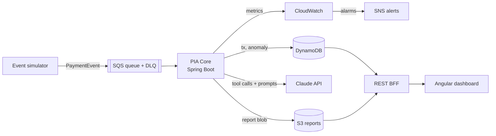

# Payment Intelligence Agent (PIA)

> Cloud-native, event-driven payment transaction intelligence agent.
> Ingests simulated payment events, detects anomalies via rules + LLM, and produces automated risk reports through Claude with autonomous tool calling.

[](./LICENSE)


---

## Table of contents

- [Why this project exists](#why-this-project-exists)
- [High-level architecture](#high-level-architecture)
- [Repository layout](#repository-layout)
- [Prerequisites](#prerequisites)
- [Quickstart](#quickstart)
- [License](#license)

---

## Why this project exists

PIA is a **portfolio-grade** implementation of a production-ready autonomous analysis agent for payment transactions. It demonstrates:

- **Hexagonal architecture** with strict separation between domain, application and infrastructure.
- **Event-driven ingestion** using SQS with DLQ, idempotent consumers, and the Outbox pattern.
- **Autonomous LLM agent** — the Claude API is wired with a proper tool-calling loop (not a one-shot prompt), giving the model first-class access to domain-aware tools.
- **AWS cloud-native** deployment on ECS Fargate with IaC via Terraform.
- **PCI-DSS mindset**: zero PAN, tokenized card references, PAN masking in logs, SSM secrets, IAM least-privilege.
- **Full observability**: structured JSON logs, Micrometer/CloudWatch metrics, OpenTelemetry traces.

## High-level architecture



## Repository layout

```
payment-intelligence-agent/
├── pia-domain/          # Pure Java domain, no framework dependency
├── pia-application/     # Use cases + ports
├── pia-infrastructure/  # Adapters: DynamoDB, SQS, S3, Claude API
├── pia-api/             # REST BFF for the Angular dashboard
├── pia-simulator/       # Deterministic + stochastic event generator
├── pia-bootstrap/       # Main Spring Boot application assembly
├── dashboard/           # Angular app
└── terraform/           # Reusable modules + dev/prod environments
```

## Prerequisites

| Tool          | Version  | Purpose                           |
|---------------|----------|-----------------------------------|
| JDK           | 21       | Build and run the JVM services    |
| Maven         | 3.8+     | Build orchestrator                |
| Docker        | 24+      | LocalStack, Testcontainers, build |
| Docker Compose| v2       | Local dev orchestration           |
| Node.js       | 20 LTS   | Angular dashboard                 |
| Terraform     | 1.9+     | Cloud provisioning                |

Optional but recommended: `awscli`, `jq`.

## Quickstart

> The commands below validate the current state of the skeleton.

```bash
# Compile every module and run unit tests
mvn clean install -DskipITs

# Apply Google Java Format (AOSP)
mvn spotless:apply

# Full verification (unit + quality plugins)
mvn verify
```

## License

Released under the [MIT License](./LICENSE).
